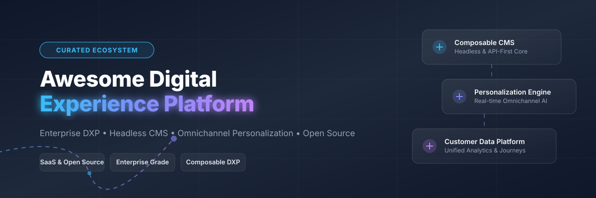

# 🚀 Awesome Digital Experience Platform (DXP)



<p align="center">
  <a href="https://github.com/ishandutta2007/Awesome-Awesome-Awesome"></a>
  <a href="https://discord.gg/jc4xtF58Ve"></a>
  <a href="https://github.com/ishandutta2007/Awesome-Awesome-Awesome"></a>
  <a href="https://github.com/ishandutta2007/Awesome-Digital-Experience-Platform/pulls"></a>
  <a href="LICENSE"></a>
  <a href="https://github.com/ishandutta2007"></a>
</p>

A comprehensive, SEO-optimized curated directory of enterprise **Digital Experience Platforms (DXP)**, **Headless CMS**, **Omnichannel Personalization Platforms**, and **Open-Source Experience Infrastructure**. 🌐✨

---

## 📑 Table of Contents

- [📊 Overview & Market Insights](#-overview--market-insights)
- [🏢 Enterprise SaaS & Hosted Platforms](#-enterprise-saas--hosted-platforms)
- [🔓 Open-Source DXP & CMS Infrastructure](#-open-source-dxp--cms-infrastructure)
- [🏗️ Architectural Patterns: Monolithic vs. Composable DXP](#%EF%B8%8F-architectural-patterns-monolithic-vs-composable-dxp)
- [🤝 How to Contribute](#-how-to-contribute)
- [💖 Support & Sponsorship](#-support--sponsorship)
- [📈 Star History](#-star-history)
- [⚠️ Disclaimer & License](#%EF%B8%8F-disclaimer--license)

---

## 📊 Overview & Market Insights

> 📈 **Estimated Sector Market Size (2026):** The global Digital Experience Platform (DXP) market size is estimated between **$15.2 Billion and $19.3 Billion** in 2026, maintaining a robust Compound Annual Growth Rate (CAGR) of **13.5%–17.8%** projected toward 2033.
>
> 🧩 **Market Fragmentation:** The DXP market structure is **concentrated at the top** by revenue (led by enterprise suites such as Adobe, Sitecore, Optimizely, and Acquia), yet **highly fragmented in execution architecture**. Organizations are increasingly adopting **Composable DXP** models, combining headless content hubs, independent CDP (Customer Data Platforms), real-time personalization microservices, and API gateway orchestrators over monolithic legacy stacks.

---

## 🏢 Enterprise SaaS & Hosted Platforms

Below is a curated comparison of leading SaaS & Commercial Digital Experience Platforms, sorted in descending order by enterprise financial scale (Annual Recurring Revenue or Market Valuation). 💰

| Platform | Company Scale / Valuation / Revenue | Pricing Tiers (Starting Price) | Free Tier / Trial Limit | Key Focus & Capabilities |
| :--- | :--- | :--- | :--- | :--- |
| **[Adobe Experience Manager (AEM)](https://business.adobe.com/products/experience-manager/adobe-experience-manager.html)** | **~$21.5B Revenue** (Adobe Inc. Parent Public Revenue) | Starts at ~$100,000/year (Tiered enterprise licensing) | Sandbox demo access via enterprise sales partner (No public free trial) | Enterprise asset management (DAM), Sites CMS, forms, and deep Experience Cloud integration. 🎨 |
| **[Bloomreach](https://www.bloomreach.com/)** | **$2.2B Valuation** ($260M+ ARR) | Starts at ~$19,000/year (Module dependent) | 14-day guided sandbox demo upon sales request | AI-driven ecommerce personalization, merchandising engine, and headless content core. 🛍️ |
| **[Acquia DXP](https://www.acquia.com/)** | **$1.1B Valuation** ($200M+ ARR) | Starts at ~$32,500/year (Cloud Starter Tier) | 30-day developer evaluation cloud environment | Enterprise cloud management & security suite built on top of Drupal core. 💧 |
| **[Sitecore](https://www.sitecore.com/)** | **$1.2B Funding** ($500M+ ARR) | Starts at ~$60,000/year (Composable Cloud bundles) | Sandbox environment for partners & certified developers | Content Hub, XM Cloud headless CMS, and real-time CDP & personalization engine. ⚡ |
| **[Optimizely DXP](https://www.optimizely.com/)** | **$600M Valuation** ($400M+ ARR) | Starts at ~$36,000/year (Content Management Starter) | 30-day free trial for experimentation / A/B testing modules | Web experimentation, feature flagging, content management, and omnichannel analytics. 🧪 |
| **[Magnolia CMS](https://www.magnolia-cms.com/)** | **~$112M Revenue** | Starts at ~$7,500/month (£6,000/mo enterprise) | 30-day full feature trial download | Hybrid headless Java CMS for multi-site and multi-language global enterprise web setups. 🌸 |
| **[Liferay DXP](https://www.liferay.com/)** | **~$37M ARR** | Starts at ~$22,000/year (Enterprise Subscription) | 30-day full enterprise trial / Community Free Core | Enterprise portal platform, B2B customer portals, and unified digital workplace solution. 🌐 |
| **[Kentico Xperience](https://www.kentico.com/)** | **~$25M Revenue** | Starts at ~$12,500/year (Xperience Refresh Tier) | 14-day full feature cloud sandbox trial | Hybrid CMS, email marketing, and built-in digital marketing for mid-market to enterprise. 📧 |
| **[Progress Sitefinity](https://www.progress.com/sitefinity-cms)** | **Part of Progress ($700M+ Rev)** | Starts at ~$15,000/year (Domain licensing model) | 30-day full featured trial | Multi-channel experience management, decopled architecture, and enterprise ASP.NET support. 💻 |
| **[CoreMedia Content Cloud](https://www.coremedia.com/)** | **~$20M Revenue** | Starts at ~$25,000/year (Composable module licensing) | Developer sandbox environment on request | High-volume omnichannel content orchestration for luxury brand e-commerce. 💎 |

---

## 🔓 Open-Source DXP & CMS Infrastructure

The open-source ecosystem forms the architectural backbone for self-hosted DXP deployments, headless content API hubs, and data privacy-compliant experience stacks. 🚀

Below are top open-source projects sorted in descending order by GitHub_Stars. ⭐

| Repository | GitHub_Stars_Badge | Primary Language / Architecture | Category & Overview |
| :--- | :--- | :--- | :--- |
| **[Strapi](https://github.com/strapi/strapi)** | [](https://github.com/strapi/strapi/stargazers) | Node.js / JavaScript | **Headless CMS** — Leading open-source Headless CMS with custom REST/GraphQL APIs and plugin engine. 🚀 |
| **[Appwrite](https://github.com/appwrite/appwrite)** | [](https://github.com/appwrite/appwrite/stargazers) | TypeScript / Docker | **BaaS / Backend Core** — Open-source backend providing auth, database, functions, and storage for DXP frontends. ⚙️ |
| **[Ghost](https://github.com/TryGhost/Ghost)** | [](https://github.com/TryGhost/Ghost/stargazers) | Node.js / JavaScript | **Publishing CMS** — Modern open-source platform for independent publishing, content delivery, and subscriptions. 👻 |
| **[Payload CMS](https://github.com/payloadcms/payload)** | [](https://github.com/payloadcms/payload/stargazers) | TypeScript / React / Next.js | **Headless CMS & Application Framework** — Code-first headless CMS built directly into Next.js. 📦 |
| **[Directus](https://github.com/directus/directus)** | [](https://github.com/directus/directus/stargazers) | Vue.js / Node.js | **Open Data Platform** — Wraps any SQL database with dynamic GraphQL and REST APIs and a no-code admin panel. 🐰 |
| **[Keycloak](https://github.com/keycloak/keycloak)** | [](https://github.com/keycloak/keycloak/stargazers) | Java | **Identity & Access Management (IAM)** — Open-source IAM for enterprise single sign-on (SSO) and customer portals. 🔑 |
| **[Medusa](https://github.com/medusajs/medusa)** | [](https://github.com/medusajs/medusa/stargazers) | TypeScript / Node.js | **Composable Commerce Engine** — Open-source commerce framework for composable DXP shopping flows. 🐙 |
| **[Saleor](https://github.com/saleor/saleor)** | [](https://github.com/saleor/saleor/stargazers) | Python / GraphQL | **Headless Commerce Platform** — GraphQL-first headless commerce engine powering rich DXP shopping experiences. ⛵ |
| **[Matomo Analytics](https://github.com/matomo-org/matomo)** | [](https://github.com/matomo-org/matomo/stargazers) | PHP / JavaScript | **Privacy Analytics** — Leading open-source web and product analytics platform with total data ownership. 📊 |
| **[Decap CMS](https://github.com/decaporg/decap-cms)** | [](https://github.com/decaporg/decap-cms/stargazers) | React / JavaScript | **Git-based CMS** — Open-source Git-based CMS for static site generators (formerly Netlify CMS). 📝 |
| **[Liferay Portal (Community)](https://github.com/liferay/liferay-portal)** | [](https://github.com/liferay/liferay-portal/stargazers) | Java | **Open Source Enterprise Portal** — Community edition of Liferay's digital experience and portal platform. 🏛️ |
| **[Drupal](https://github.com/drupal/drupal)** | [](https://github.com/drupal/drupal/stargazers) | PHP | **Enterprise CMS Engine** — Powerhouse open-source CMS foundation powering Acquia and global enterprise sites. 💧 |
| **[WordPress Core](https://github.com/WordPress/WordPress)** | [](https://github.com/WordPress/WordPress/stargazers) | PHP / JavaScript | **Web Content Core** — Ubiquitous web content platform extended via headless APIs and enterprise plugins. 📝 |

---

## 🏗️ Architectural Patterns: Monolithic vs. Composable DXP

```
+-----------------------------------------------------------------------+
|                            COMPOSABLE DXP                             |
+-----------------------------------------------------------------------+
|  Frontend / Headless Layer (Next.js, Nuxt, Remix, Mobile Apps)        |
+-----------------------------------------------------------------------+
|  API Gateway & Orchestration (GraphQL Federation / REST)               |
+-------------------+-------------------+-------------------------------+
|  Headless Content |  Commerce Engine  |  Personalization & CDP        |
|  (Strapi/Payload) |  (Medusa/Saleor)  |  (Matomo / Segment)           |
+-------------------+-------------------+-------------------------------+
```

### 💡 Key Differences:
- **Monolithic DXP:** Single vendor provides CMS, DAM, Analytics, Search, and Personalization in a tightly coupled suite (e.g. Adobe AEM, Sitecore). High governance, high initial license cost.
- **Composable DXP:** Best-of-breed microservices connected via APIs and GraphQL federation. Lower vendor lock-in, faster time to market for developer teams.

---

## 🤝 How to Contribute

Contributions are welcome! Please follow these guidelines: 📝

1. Fork the repository.
2. Edit `README.md` keeping the Markdown tabular formatting consistent.
3. For SaaS entries, provide factual pricing, trial duration, and company scale metrics.
4. For Open-Source entries, ensure official GitHub repository URLs and correct Stars_Badge tags.
5. Create a clean Pull Request describing your additions.

---

## 💖 Support & Sponsorship

If you find this curated directory helpful for your digital experience architecture, research, or projects, please consider supporting the maintenance! 🌟

- ⭐ **Star this repository** to help others discover it.
- 🔀 **Fork & Share** with your engineering and product teams.
- ☕ **Buy me a coffee / Sponsor**: If you'd like to support ongoing open-source projects and updates, consider sponsoring on the [GitHub Sponsors Dashboard](https://github.com/sponsors/ishandutta2007). Thank you for your support! ❤️

---

## 📈 Star History

[](https://star-history.dera.page/#ishandutta2007/Awesome-Digital-Experience-Platform&type=date&legend=top-left)

---

## ⚠️ Disclaimer & License

- **Disclaimer:** All product names, logos, and brands are property of their respective owners. Company pricing and financials are gathered from publicly available business disclosures, financial reports, and vendor sites as of 2026.
- **License:** Distributed under the MIT License. See `LICENSE` for more information.

---

**Maintained with ❤️ by Digital Experience Architects & Open-Source Engineering Teams.**
